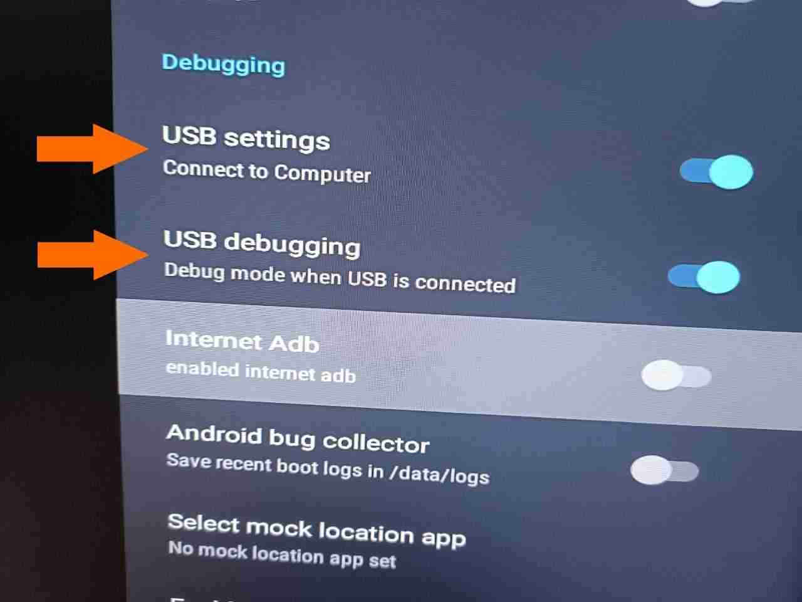

# Activating OTG in the USB2 port

**DISCLAIMER**: You may brick/damage your box, do only if you know what you're doing and at your own risk

Only tested for H96 Max v58 (Rockchip RK3588).

Tested under Debian on X86_64 and based on the notes from @phhusson at https://github.com/phhusson/h96-rk3588-v58.

By default it appears the usb ports are in host mode in these boxes.

## Check if adb is already possible

- Connect the cable to the **black** USB port.
- Activate the USB connection and debugging in the developer Options.
    - To activate the developer options go to the About section and press the build_number 10 times.




If the computer recognizes the device as an android device try to find if adb recognizes it:

```adb devices```

Should print the device (code may vary):

```
List of devices attached
xxxxxxxxxxxxxx1wp75Q    device
```

If it prints nothing then you have to enable otg on the port.

## Pre-requisites (for Debian)

Install libusb-dev, abootimg, mkbootimg, git, build-essential and dtc via apt.
`apt install abootimg mkbootimg libusb-dev-1.0-0 git device-tree-compiler build-essential`

### Get rkbin

Get them from [https://github.com/rockchip-linux/rkbin](https://github.com/rockchip-linux/rkbin)
This provides `resource_tool` under tools among other stuff.

### Get rkflashtool

This allows to unpack the firmware.
Get my [my fork](https://github.com/ncravino/rkflashtool/tree/ncravino/rk3588/add-model-fix-boot-fix-size) that has a fix for an error with RK3588.

After cloning:
    - `git checkout ncravino/rk3588/add-model-fix-boot-fix-size`
    - `make`

### Get magisk

    See [get_magisk_boot.sh](../scripts/get_magisk_boot.sh) for details.
    - get the apk from [https://github.com/topjohnwu/Magisk](https://github.com/topjohnwu/Magisk)
    - change magisk apk extension to .zip 
    - unzip to a folder (e.g. `./magisk`)
    - change the name of the magiskboot tool and make it executable
```{bash}
    $ mkdir -p magisk/linux 
    $ mv magisk/lib/$(arch)/libmagiskboot.so magisk/linux/magiskboot 
    $ chmod 755 magisk/linux/magiskboot
 ```

### Download the official firmware

You can find the latest stock at [Firmware Download](https://www.h96tvbox.com/firmware-download/).
It's the one for H96 Max V58 (RK3588).

### Install platform-tools

Get them from [Google Platform Tools](https://developer.android.com/tools/releases/platform-tools).

## Activating OTG for adb by changing the dtb in boot.img

- runpackfw is the executable from rkflashtool.
- magiskboot is the executable from magisk.
- resource_tool is the executable from kbin.
- $IMG_FILE is the full path to .img with the stock firmware.

I'll be worked under `./workdir/` and created folders for the various steps.

### 0. create workdir and cd into it

`mkdir ./workdir && cd workdir`

### 1. use rkunpackfw to unpack the official.img

`rkunpackfw $IMG_FILE`

### 2. use abootimg to unpack boot.img from 1.

`(mkdir -p boot && cd boot && abootimg -x ../Image/boot.img)`

### 3. use magiskboot to unpack boot.img from 1.

`(mkdir -p magisk && cd magisk && $MAGISKBOOT_BIN unpack ../Image/boot.img)`

### 4. use resource_tool to unpack second.img (or just second) from 3.

`(mkdir -p second && cd second && $RESOURCE_TOOL_BIN --image=../magisk/second --unpack)`

### 5. use dtc to decompile the dtb from 4.

`dtc -I dtb -O dts second/out/rk-kernel.dtb -o second/dts  2> /dev/null`

### 6. search for usb@fc000000 and change dr_mode from host to otg

Edit the file `./workdir/second/dts`.
See [dts.patchfile](../scripts/dts.patchfile) for details.

### 7. create a new_second folder with the files from second.img from 4. 

```
mkdir -p new_second && cp second/out/* new_second/
rm new_second/rk-kernel.dtb
```

### 8. Compile the dts from 6. with dtc to replace the dtb with the dtb from 7.

`dtc second/dts -o new_second/rk-kernel.dtb 2> /dev/null`

### 9. pack a new second.img with resource_tool

`resource_tool --image=./new_second.img --pack new_second/*`

### 10. make new boot image with mkbootimg

Get the cmdline ($CMDLINE) from `./workdir/boot/bootimg.cfg` e.g.:

```console=ttyFIQ0 firmware_class.path=/vendor/etc/firmware init=/init rootwait ro loop.max_part=7 androidboot.console=ttyFIQ0 androidboot.wificountrycode=XS androidboot.hardware=rk30board androidboot.boot_devices=fe2e0000.mmc androidboot.selinux=permissive buildvariant=userdebug```

mkbootimg --kernel ./boot/zImage --ramdisk ./boot/initrd.img --second ./new_second.img -o ./new_boot.img --cmdline "$CMDLINE"

### 11. flash the new boot image from 10. onto boot or recovery using fastboot

- Connect the cable to the **black** USB port.
- put the device in fastboot, see [Booting](./booting.md)
- then execute the command to flash

to flash to boot: ```fastboot flash boot ./workdir/new_boot.img```

or

to flash to recovery: ```fastboot flash recovery ./workdir/new_boot.img```

### 12. reboot to system

- It should boot normally
- If it enters the boot menu try:
  - disconnecting the usb and rebooting
  - selecting "enter recovery"
  - power off/power on
  - flashing again

#### 13. go to developer options and activate usb debugging and computer connection

- Activate the USB connection and debugging in the developer Options.
  - To activate the developer options go to the About section and press the build_number 10 times.


#### 14. connect usb to black port and use adb devices to check for the device

```adb devices```

Should print the device (code may vary):

```
List of devices attached
xxxxxxxxxxxxxx1wp75Q    device
```

#### 15. use adb shell to check for the change

```adb shell 'cat /proc/device-tree/usbdrd3_0/usb@fc000000/dr_mode'```

Should print:

```otg```


#### Notes

If USB debugging is active keyboards and other peripherals will not work on that port, disable debugging to use it.

## Script

See [activate_adb.sh](../scripts/activate_adb.sh) for execution details.

