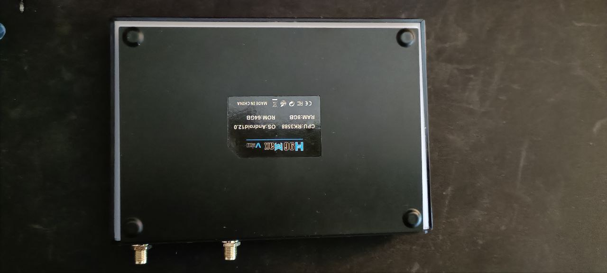
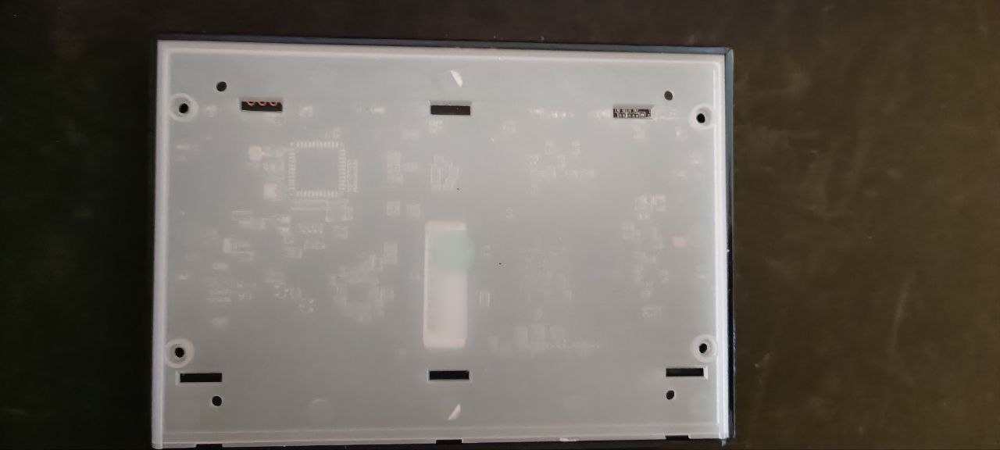
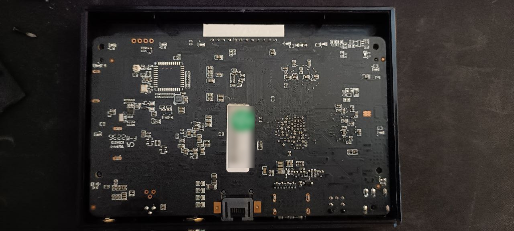
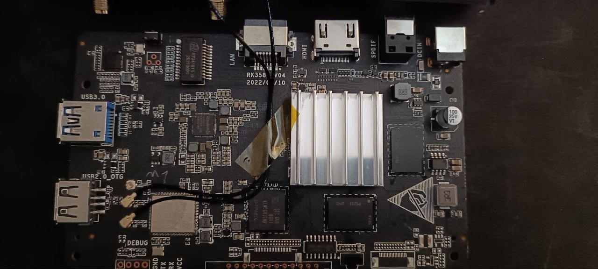

# Disassembling the H96 MAX V58

**DISCLAIMER**: You may brick/damage your box, do only if you know what you're doing and at your own risk

This box is fairly easy to disassemble, as there are only 4 screws hidden under a easily removable bottom cover.
We can open the whole thing in less than 5 minutes and without destroying anything in the process.

## Step by step Procedure

### Removing the bottom cover

Using a thin plastic card just go around the border where the white plastic meets the black bottom and lift carefully. It's probably easier to start near the feet indentations.

### Removing the white bottom cover

Just remove the screws and lift it.

#### Removing the black plate

Just lift it with the plastic card, it's not fixed by anything other than the screws.

### Removing the board from the case

Pick it by the LCD and lift carefully, it should come off easily. The LCD is the white thing in the photo bellow.

### The Board Features

- The 4 pin debug port is available
  - You can see it at the bottom left in the photo above
- The GPIO is not exposed
- The cooling is passive
  - The stock cooler uses tape
    - we might be able to replace the stock cooler with a larger one for less thermal throttling
  - There might be a way to get a small blower in there
    - Where can we get power?
  